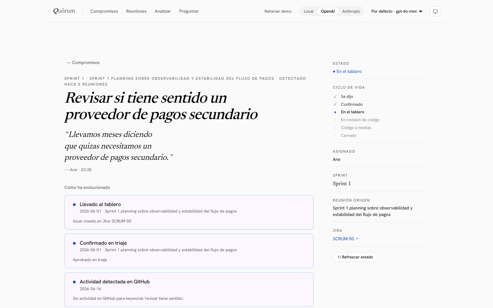
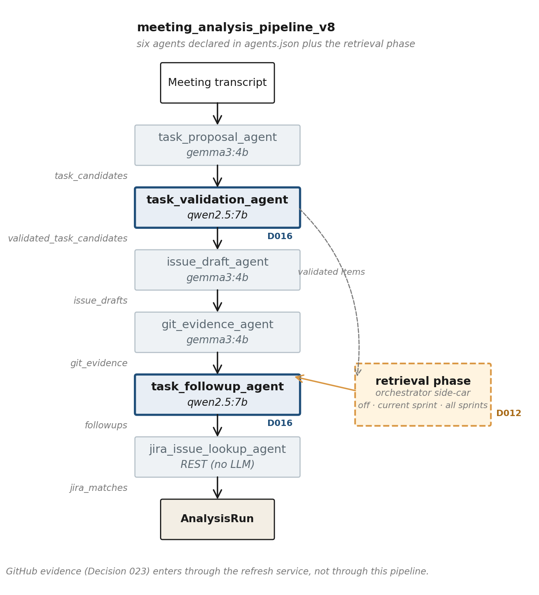

<div align="center">

# *Q*uórum

**A local-first multi-agent system that turns meeting transcripts into auditable, cross-meeting commitments — and keeps them in sync with Jira and GitHub.**

[](https://www.python.org/downloads/)
[](https://nodejs.org/)
[](https://react.dev/)
[](https://fastapi.tiangolo.com/)
[](LICENSE)



</div>

---

## What it does

Software teams meet, decide, and forget. The substantive decisions of agile work happen in conversation; the formal layer of Jira issues and Git commits is, at best, a partial and lagging reflection of the room. Quórum closes that gap.

Given a meeting transcript, Quórum:

1. **Detects commitments** — the things people in the room said they would do — through a six-agent pipeline.
2. **Reasons across meetings** — recognising when a commitment recurs without being resolved, when its scope has changed, when a blocker appears or is lifted, when a new proposal duplicates an existing one, when a previous decision is contradicted, and when something is verbally closed.
3. **Bridges to the formal layer** — creating Jira issues from approved commitments, pulling status from Jira and pull-request activity from GitHub on demand, and pushing local lifecycle changes back to Jira automatically.
4. **Answers natural-language questions** about the team's history with a retrieval-augmented Q&A surface that cites the fragments it uses.

By default it runs entirely on the developer's workstation through [Ollama](https://ollama.com/); an opt-in runtime profile lets the same pipeline be benchmarked against OpenAI or Anthropic without modifying any agent.

## Why it's different

| Quórum | Most meeting-AI tools |
|---|---|
| Models the **commitment** as a first-class entity with a persisted lifecycle across meetings | Treat each meeting as an isolated event; produce summaries you copy by hand |
| **Cross-meeting reasoning** with a closed seven-type follow-up taxonomy | Surface extraction per meeting only |
| **Local-first by default** (Ollama), with a frontier profile for benchmarking only | Cloud-hosted LLMs; transcripts always leave the host |
| Closed-loop **bidirectional sync** with Jira (no polling, no webhooks) and read-only GitHub PR signals | One-way export to a tracker, if any |
| Six defensive **guardrails** on the Q&A path with an audit log | Confident answers with no grounding contract |

## Quickstart

### Requirements

- Python 3.11 or later
- Node.js 20 or later
- [Ollama](https://ollama.com/) running locally, with `gemma3:4b`, `qwen2.5:7b` and `embeddinggemma` pulled
- (Optional) Jira Cloud project + API token, a Git repository to mine for evidence, a GitHub token with `public_repo` scope

### Run

```bash
# 1. Backend (FastAPI + agents)
python -m venv .venv && source .venv/bin/activate     # Windows: .venv\Scripts\activate
pip install -r requirements.txt
cp .env.example .env                                   # fill in any optional integrations
python start.py                                        # serves the app on http://localhost:8000

# 2. Frontend (React + Vite, dev mode with hot reload)
cd frontend
npm install
npm run dev                                            # http://localhost:5173/static/
```

A single `python start.py` will build the frontend on first run and serve the SPA from FastAPI's static path, so you do not need step 2 unless you are working on the UI.

## Architecture

The system is organised around the **commitment** as the first-class entity of the domain. Six agents declared in [`app/config/agents.json`](app/config/agents.json) form the analysis pipeline; the orchestrator runs an additional retrieval phase between validation and follow-up reasoning.



GitHub evidence enters through a separate `CommitmentRefreshService` rather than through the per-meeting pipeline. Jira state is propagated automatically when a commitment transitions to `evidenced` or `closed`.

### Six screens

1. **Compromisos** — board of active commitments grouped by attention, filterable by sprint.
2. **Detail** — editorial document view with the verbatim `trigger_quote`, the timeline of follow-ups, and the evidence collected from Git and GitHub.
3. **Reuniones** — transcripts grouped by sprint.
4. **Analizar** — ingestion view for new transcripts.
5. **Preguntar** — composer-style Q&A surface with sprint scoping and bracketed citations.
6. **Evaluación** — research view that runs the dataset evaluators and renders precision/recall/F1 as an editorial report.

## Project structure

```
quorum/
├── app/                 # FastAPI backend
│   ├── agents/          # The six pipeline agents + GithubEvidenceAgent
│   ├── api/             # HTTP routes and request models
│   ├── config/          # agents.json, prompts/, runtime profiles
│   ├── domain/          # Pydantic models for the domain
│   └── services/        # commitment_sync, refresh, jira_sync, qa, indexer
├── frontend/            # React + TypeScript SPA (Vite)
├── examples/
│   └── demo_repo/       # A small synthetic repo used to demo Git evidence
├── scripts/             # Build, regen figures, capture UI, eval runs
└── tests/               # pytest regression suite
```

## Acknowledgments

Quórum was developed as a double final degree project (PCEO) in Computer Engineering and in Data Science and Artificial Intelligence at the University of Deusto.

The pattern of treating commitments as first-class entities, with a forward-only lifecycle and a reconstructible timeline, is the contribution of this project. Tooling that made the work tractable: [FastAPI](https://fastapi.tiangolo.com/), [Pydantic](https://docs.pydantic.dev/), [React](https://react.dev/), [Vite](https://vitejs.dev/), [Ollama](https://ollama.com/), [Newsreader](https://fonts.google.com/specimen/Newsreader) and [Hanken Grotesk](https://fonts.google.com/specimen/Hanken+Grotesk) for the editorial typography.

## License

Quórum is released under the [MIT License](LICENSE).
